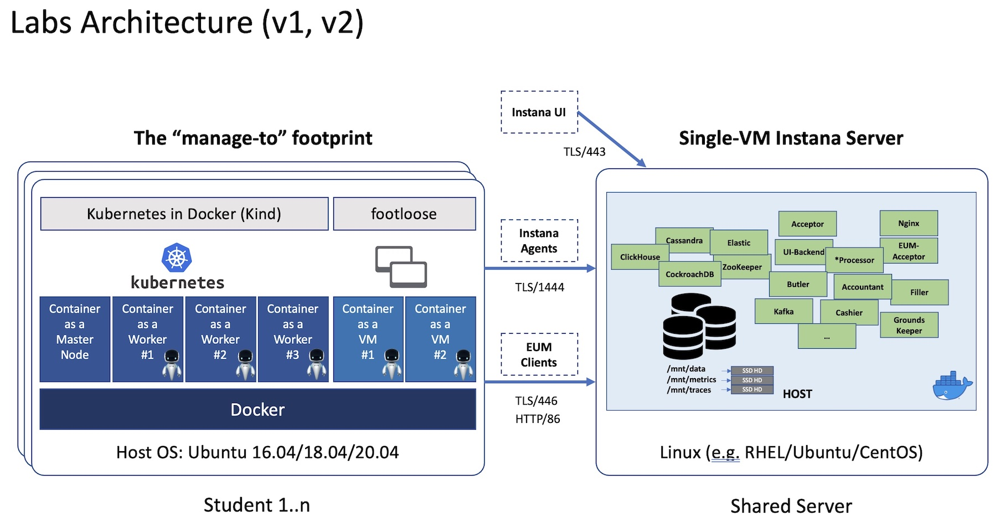
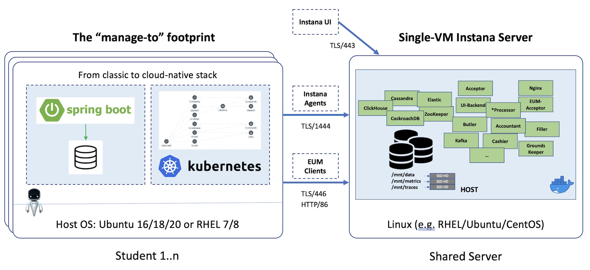

# Instana Labs' Scripts / Commands

## Overview

This repo contains the copy-paste friendly scripts/commands for my Instana hands-on labs.

How to obtain it?

```sh
git clone https://github.com/brightzheng100/instana-handson-labs.git
cd instana-handson-labs
ls -l
```

## Versions

The labs are evolving.

## Previous Labs Architecture, aka V1, V2

V1, v2 were based on `Kind` for Kubernetes and `footloose` for VM-based experience, like this:



But actually these environments are not officially supported even they work.

If you really want to try it out, do this:

```sh
git clone https://github.com/brightzheng100/instana-handson-labs.git
cd instana-handson-labs
git checkout labs-v2
ls -l
```

## Current Labs Architecture, aka V3

Current labs architecture is dynamic, which will be transitioned from VM-based to Kubeadm-bootstrapped Kubernetes based experience, like this:



This is the current labs architecture:

```sh
git clone https://github.com/brightzheng100/instana-handson-labs.git
cd instana-handson-labs
ls -l
```
